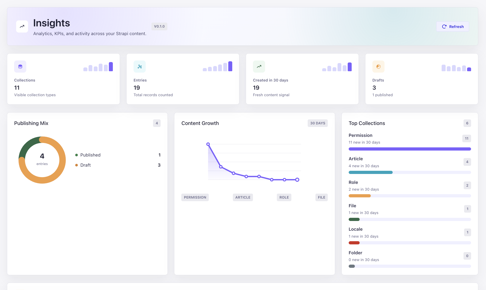

# Strapi Insights

Analytics, KPIs, charts, and activity insights for your Strapi content.

`strapi-plugin-insights` adds a read-only analytics dashboard to the Strapi admin panel so content teams and developers can quickly understand collection growth, publishing state, and recent content activity.

## Dashboard Preview



## Features

- Dashboard KPIs for collection count, total entries, drafts, published entries, and recent content growth
- Collection-level analytics across all visible Strapi collection types
- Draft and published counts for content types that use draft/publish
- 30-day content growth chart
- Publishing mix donut chart
- Top collections chart
- Recent activity feed based on updated content
- Collection KPI table with counts, activity, and share bars
- Read-only by design: the plugin does not modify your content

## Installation

```bash
npm install strapi-plugin-insights
```

Enable the plugin in `config/plugins.js` or `config/plugins.ts`:

```js
export default {
  'strapi-plugin-insights': {
    enabled: true,
  },
};
```

Rebuild and restart Strapi:

```bash
npm run build
npm run develop
```

After Strapi starts, open the admin panel and select **Insights** from the sidebar.

## Requirements

- Strapi `>=5.0.0`
- React `^18.2.0`
- Node version supported by your Strapi 5 project

## What It Measures

The dashboard is generated dynamically from your Strapi content types and database records.

- **Collections**: visible collection types registered in Strapi
- **Entries**: total records per collection
- **Created in 30 days**: records created in the last 30 days
- **Updated today**: records updated since the start of the current day
- **Published**: records with `publishedAt` when draft/publish is enabled
- **Drafts**: records without `publishedAt` when draft/publish is enabled
- **Recent activity**: latest updated entries across collections

## Privacy And Data

Strapi Insights reads metadata and counts from your local Strapi application. It does not send analytics data to any external service.

## Current Limitations

- The dashboard is read-only.
- API traffic analytics are not tracked yet.
- User activity auditing is not tracked yet.
- Historical daily trend storage is not included yet; current charts use available collection metrics.

## Roadmap

- Daily historical trend snapshots
- User activity and audit logs
- API usage insights
- Media library analytics
- Collection health score
- Custom KPI widgets
- Date range filters
- Exportable reports

## Development

```bash
npm install
npm run build
npm run verify
```

For local testing in a Strapi app:

```bash
npm install ./path-to/strapi-plugin-insights
```

Then enable the plugin in the Strapi app's `config/plugins` file.

## License

MIT
